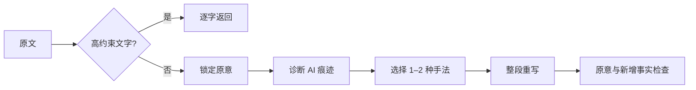

<div align="center">
  

  # 白描 · Baimiao

  **把一段中文，改出人写的分寸和文采。**

  `通用中文改写` · `保留原意` · `自然表达` · `文采润色`
</div>

## 它做什么

输入一段中文初稿，输出一段更自然、更准确，也更有文采的中文。它可以清理 AI 痕迹，但“去 AI 味”只是其中一种用途。

白描会删除空泛开场、机械连接词、重复解释和过量金句，也会调整信息顺序、句子呼吸、用词分寸与段落推进。它不是同义词替换器：文采来自判断、取舍和节奏，同时仍然保留原意、事实、确定程度和原本文体。



用户通常只需要给出原文。无需填写说话人、受众、传播目标或视频结构。

## 适用文本

- 文章与普通段落
- 工作邮件与通知
- 报告与总结
- 产品介绍与社交媒体
- 知识解释与观点评论
- 人物故事与叙事文本

医疗、法律、安全、合同、免责声明和责任文字默认逐字返回。白描不会为了“更自然”削弱义务、警告或不确定性。

## 二十五种手法

手法分为五组：

| 解决的问题 | 方法 |
|---|---|
| 内容落地 | 结果先行、动作承载、物件承载、数字对比、引语承载、名词列锦 |
| 信息顺序 | 事实并置、特写、预叙、重复升级、第三拍转向、回声照应、蒙太奇并置 |
| 句子呼吸 | 长短句换挡、独句落点、情绪延迟、引语留白 |
| 叙述态度 | 显示而非讲述、叙述距离、轻描归因、陌生化、反讽与距离 |
| 收住结尾 | 动作收尾、条件收尾、问题收尾 |

每一种方法都包含原文信号、前后案例和撤销条件。完整内容见 [二十五种写作手法](references/guided-methods.md)。

## 快速对比

### 工作总结

**原文**

> 在本周的工作中，我们围绕项目推进开展了一系列卓有成效的工作。首先完成需求梳理，其次优化三个核心页面，最后修复十二个问题……

**白描后**

> 本周完成了需求梳理，优化了三个核心页面，修复了十二个问题。项目质量得到提升，也为后续推进打下了基础。

### 高约束说明

**原文与白描后完全相同**

> 本功能仅用于辅助整理，不构成医疗诊断。出现胸痛、呼吸困难或意识异常时，应立即联系当地急救服务。

这里的“不改”同样是正确结果。

更多对比见 [可视化说明页](showcase/index.html)。

## 使用方法

```text
使用 $baimiao 改写下面这段中文，保留原意和文体，只输出改写后的完整文本。

[原文]
```

默认只输出改写结果。需要审稿时，可以要求同时给出原文、改写后、主要改动、使用手法和撤销条件。

## GLM-5.2 实测

当前测试覆盖工作总结、邮件、产品介绍、社交文字、知识解释、人物故事、观点评论和高约束说明。

- 当前回归覆盖 8 类文本。
- 每次请求完整加载 `SKILL.md`、手法案例和评审标准。
- 请求没有设置 `max_tokens`。
- 客户端没有设置超时。
- 当前结果通过原意守恒、零新增事实、文体守恒和高约束保护检查。

查看 [实测输出](tests/glm-results.json) 与 [测试说明](tests/glm-evaluation-report.md)。

复现实验：

```bash
export ADORE_API_KEY="your-key"
export ADORE_BASE_URL="https://example.com/v1"
export ADORE_MODEL="your-model"
python scripts/run_glm_evaluation.py
```

脚本不会把密钥写入结果文件。

## 校验

```bash
python scripts/validate_package.py
```

## 许可证

本项目采用 [Apache License 2.0](LICENSE)。
